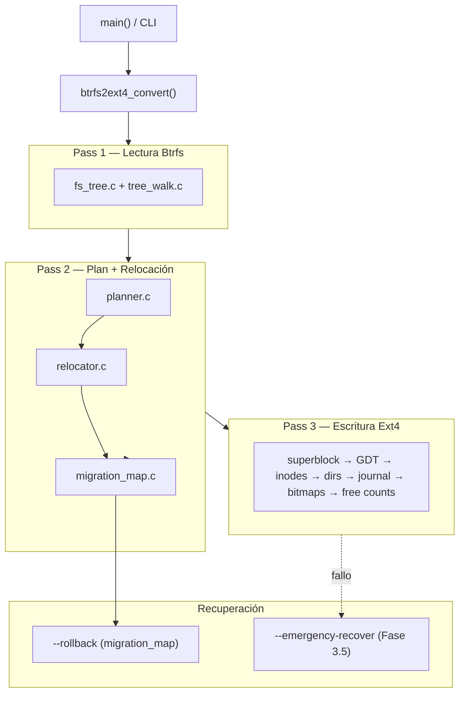

# Plan de implementación — btrfs2ext4

Documento maestro de estabilización y corrección del conversor in-place Btrfs → Ext4.
Refleja el análisis profundo del código, las fases ejecutadas (best-of-N) y el roadmap pendiente.

**Última actualización:** 2026-06-11  
**Rama de referencia:** `cursor/phase2-foundations-76a0`  
**Estado del proyecto:** `0.2.0-alpha`

---

## Tabla de contenidos

1. [Resumen ejecutivo](#1-resumen-ejecutivo)
2. [Arquitectura y flujo](#2-arquitectura-y-flujo)
3. [Fase 0 — Fundamentos](#fase-0--fundamentos) ✅
4. [Fase 1 — Integridad Ext4 (P0)](#fase-1--integridad-ext4-p0) ✅
5. [Fase 2 — Lector Btrfs](#fase-2--lector-btrfs) ✅
6. [Fase 3 — Recuperación Pass 2 (Opción A)](#fase-3--recuperación-pass-2-opción-a) 🔲
7. [Fase 3.5 — Emergencia Pass 3](#fase-35--emergencia-pass-3) 🔲
8. [Fase 4 — Planificación y espacio](#fase-4--planificación-y-espacio) 🔲
9. [Fase 5 — Optimizaciones de rendimiento](#fase-5--optimizaciones-de-rendimiento) 🔲
10. [Fase 6 — Tests e infraestructura](#fase-6--tests-e-infraestructura) 🔲
11. [Fase 7 — API, CLI y limpieza](#fase-7--api-cli-y-limpieza) 🔲
12. [Métricas de éxito](#métricas-de-éxito)
13. [Decisiones de diseño registradas](#decisiones-de-diseño-registradas)

---

## 1. Resumen ejecutivo

`btrfs2ext4` convierte un filesystem Btrfs a Ext4 **in-place** en tres pasadas:

| Pasada | Función | Riesgo principal |
|--------|---------|------------------|
| **Pass 1** | Leer metadata Btrfs en memoria | Datos incorrectos por extents parciales / PREALLOC |
| **Pass 2** | Planificar layout Ext4 + relocar bloques en conflicto | Pérdida de datos si falla mid-relocation |
| **Pass 3** | Escribir estructuras Ext4 (superblock, GDT, inodos, bitmaps, dirs, journal) | Filesystem híbrido irrecuperable si se interrumpe |

### Problemas P0 aún abiertos (post Fase 2)

| # | Problema | Fase que lo resuelve |
|---|----------|---------------------|
| 1 | `migration_map_save(count=0)` no escribe footer ni hace sync | **Fase 3** |
| 2 | Alineación del mapa puede solapar footer | **Fase 3** |
| 3 | `journal.c` implementado pero nunca conectado (código muerto) | **Fase 3** (eliminar) |
| 4 | `check_battery_safe()` solo antes de Pass 3, no antes de relocación | **Fase 3** |
| 5 | Checksum por entrada no verificado en rollback | **Fase 3** |
| 6 | `--rollback` no deshace metadata Ext4 de Pass 3 | **Fase 3.5** |
| 7 | Planner no reserva espacio para journal / HTree / CoW | Fase 4 |
| 8 | Sin test E2E Btrfs → convert → `e2fsck` | Fase 6 |

---

## 2. Arquitectura y flujo



### Archivos clave por subsistema

| Subsistema | Archivos |
|------------|----------|
| Orquestación | `src/main.c`, `include/btrfs2ext4.h` |
| Lector Btrfs | `src/btrfs/fs_tree.c`, `tree_walk.c`, `chunk_tree.c` |
| Planificador | `src/ext4/planner.c` |
| Escritor Ext4 | `src/ext4/inode_writer.c`, `dir_writer.c`, `bitmap_writer.c` |
| Relocación | `src/relocator.c`, `src/migration_map.c` |
| Journal (muerto) | `src/journal.c` — **a deprecar en Fase 3** |
| I/O | `src/device_io.c` |
| Tests | `tests/test_integration.c` (mejor cobertura) |

---

## Fase 0 — Fundamentos ✅

**Estado:** Completada (`cursor/phase0-foundations-76a0`, PR #3)  
**Enfoque ganador:** Approach C + cherry-picks de A y B

| Tarea | Resultado |
|-------|-----------|
| CI GitHub Actions | Matrix GCC/Clang × Debug/Release, workflow reutilizable |
| Sanitizers | `BTRFS2EXT4_ENABLE_SANITIZERS` — ASan+UBSan en 4 tests |
| Bug `goto cleanup`/alloc | `struct convert_state` + `alloc_initialized` |
| Exit codes | API 0/-1, CLI 0/1 |
| Docs | TECHNICAL.md, CONTRIBUTING.md, CHANGELOG, README badge CI |

---

## Fase 1 — Integridad Ext4 (P0) ✅

**Estado:** Completada (`cursor/phase1-foundations-76a0`, PR #4)  
**Enfoque ganador:** Approach B (full correctness)

| Tarea | Resultado |
|-------|-----------|
| Orden bitmaps Pass 3 | `ext4_finalize_bitmaps()` al final, tras dirs+journal |
| Directorios | Half-MD4, `INDEX_FL` solo HTree, metadata preservada |
| Checksums | METADATA_CSUM en superblock, GDT e inodos |
| Extents | `fi->offset`, bloques parciales, fallback físico post-relocación |
| Tests | E-4, E-5, E-6, Group J (37 tests integración) |

---

## Fase 2 — Lector Btrfs ✅

**Estado:** Completada (`cursor/phase2-foundations-76a0`, PR #5)  
**Enfoque ganador:** Approach B (dynamic chunk_tree + fixes end-to-end)

| Tarea | Resultado |
|-------|-----------|
| PREALLOC | `btrfs_extent_is_sparse()` → holes; skip en pipeline |
| chunk_tree | `btrfs_tree_walk()` con stack dinámico y validación completa |
| OOM inline | Error propagado hasta `btrfs_read_fs` |
| CoW hash | Clave `(bytenr, num_bytes)` |
| METADATA_ITEM | `length = nodesize` |
| Coalescing | Guard con `offset != 0` |
| Tests | Group 11 (stress), fuzz, Group K (integration) |

---

## Fase 3 — Recuperación Pass 2 (Opción A) 🔲

**Objetivo:** Hacer que `--rollback` funcione en **todos** los escenarios documentados de Pass 2, con un único mecanismo simple y mantenible.

### Decisión: Opción A — Solo `migration_map`

Se descartaron las opciones B (journal WAL) y C (dual layer) tras comparación:

| Criterio | Opción A ✅ | Opción B (journal) | Opción C (dual) |
|----------|------------|-------------------|-----------------|
| Complejidad | Baja | Media-alta | Alta |
| I/O en HDD | 1 sync al guardar mapa | 1 sync **por move** | Ambos |
| Recovery automático | No (manual `--rollback`) | Sí | Parcial |
| Mantenibilidad | **Alta** | Media | Baja |
| Código muerto | Elimina `journal.c` | Activa journal | Mantiene ambos |
| Adecuado para alpha | **Sí** | Marginal | No |

**Razón principal:** el `migration_map` ya está cableado en `main.c`; el journal tiene bugs latentes (`seq` vs índice tras `qsort`, replay truncado a 16 MiB, nunca inicializado) y duplicaría la fuente de verdad.

### Tareas de implementación

#### 3.1 Footer con `count=0` (CRÍTICO)

**Archivo:** `src/migration_map.c`

**Problema actual:**

```c
if (plan->count == 0)
    return 0;  // ← sale sin footer ni device_sync()
```

El comentario en `main.c:352` promete checkpoint de rollback, pero `migration_map_rollback()` requiere magic `B2E4MAP1` en el footer.

**Fix:**

- Con `count=0`: escribir footer con `entry_count=0`, magic válido, CRC32 del mapa vacío
- Llamar `device_sync()` siempre antes de retornar éxito
- El backup del superblock Btrfs ya se escribe (líneas 19–25); solo falta el footer

#### 3.2 Alineación del mapa (CRÍTICO)

**Archivo:** `src/migration_map.c:52–53`

**Problema:** `map_offset &= ~4095ULL` redondea **hacia abajo**, pudiendo solapar entries con la región del footer (8 KiB antes del backup).

**Fix:**

- Redondear `map_offset` **hacia arriba** al siguiente límite de 4 KiB
- Validar que `map_offset + map_size + MIGRATION_FOOTER_OFFSET <= backup_offset`
- Abortar con error claro si no cabe

#### 3.3 Validación en rollback (ALTO)

**Archivo:** `src/migration_map.c` — `migration_map_rollback()`

| Validación | Detalle |
|------------|---------|
| Bounds | `map_offset + map_size <= dev->size` |
| Entry checksum | Verificar `re->checksum` (CRC32C acumulado en `relocator_execute`) |
| Per-entry bounds | `src_offset + length <= dev->size`, idem `dst_offset` |
| Footer sanity | Rechazar `entry_count` absurdos aunque CRC del mapa pase |

#### 3.4 Seguridad operativa (ALTO)

**Archivo:** `src/main.c`

- Mover `check_battery_safe()` **antes** de `relocator_execute()` (no solo antes de Pass 3)
- Pass 2 con relocación es igual de destructivo que Pass 3 en términos de pérdida por corte de energía

#### 3.5 Limpieza de `journal.c` (MEDIO)

**Archivos:** `src/journal.c`, `include/journal.h`, `src/relocator.c:532`

| Acción | Detalle |
|--------|---------|
| Eliminar llamada a `journal_replay_partial()` en `relocator_execute` | Hoy lee offset 0 (inútil) |
| Opción preferida | Eliminar `journal.c` del build y marcar deprecated en TECHNICAL.md |
| Opción conservadora | Mantener archivo con `#if 0` y comentario "reservado para futuro" |

#### 3.6 Tests

| Test | Qué valida |
|------|------------|
| `test_migration_map_zero_entries` | `save(count=0)` → footer válido → `rollback()` exitoso |
| `test_migration_map_alignment` | Mapas grandes no solapan footer |
| `test_migration_map_entry_checksum` | Rollback rechaza entry con checksum corrupto |
| `test_rollback_restores_superblock` | Magic Btrfs restaurado en `0x10000` |

### Orden de implementación sugerido

```
3.1 Footer count=0     ← crítico, desbloquea rollback sin relocaciones
3.2 Alineación       ← crítico
3.4 Battery check    ← alto, cambio pequeño en main.c
3.3 Validación       ← alto
3.5 Limpieza journal ← medio
3.6 Tests            ← continuo
```

### Criterio de aceptación

- Simular interrupción tras `migration_map_save` con `count=0` → `--rollback` restaura Btrfs montable
- Simular con N relocaciones → rollback revierte todos los moves + superblock
- `ctest` 4/4 verde; sin regresiones en tests de integración existentes

---

## Fase 3.5 — Emergencia Pass 3 🔲

**Objetivo:** Ofrecer una vía de recuperación cuando la conversión **falla o se interrumpe durante Pass 3**, escenario que la Fase 3 **no cubre**.

### Limitación que ninguna opción de Fase 3 resuelve

Si Pass 3 comienza (se escriben superblock, GDT, inodos, bitmaps, directorios o journal Ext4) y el proceso se interrumpe:

- El dispositivo queda en estado **híbrido** (metadata Ext4 parcial + datos Btrfs)
- `--rollback` restaura el superblock Btrfs pero **no borra** lo escrito en Pass 3
- `e2fsck` y `btrfs check` pueden fallar ambos
- El banner actual ya advierte: *"render the filesystem UNMOUNTABLE"*

La Fase 3.5 no pretende conversión perfecta post-crash, sino **detección de estado + protocolo de emergencia** para minimizar daño y guiar al usuario.

### Diseño: `conversion_state` en disco

Nuevo footer ligero en la cola del dispositivo (distinto del migration map), actualizado en cada hito de Pass 3:

```
[... datos ...][migration entries][migration footer][sb backup]
                      ↑
              (ya existe desde Fase 3)

Nuevo (Fase 3.5):
[...][CONVERT_STATE 64B][migration map...]
```

#### Estructura propuesta: `struct convert_state_footer`

```c
#define CONVERT_STATE_MAGIC "B2E4CVST"

struct convert_state_footer {
    char     magic[8];           /* "B2E4CVST" */
    uint32_t phase;              /* 0=idle, 2=pass2_done, 3=N (ver bitmask) */
    uint32_t pass3_step_mask;    /* bitmask de pasos Pass 3 completados */
    uint64_t timestamp;          /* CLOCK_REALTIME al último update */
    uint32_t crc32;
    uint32_t padding[9];
};
```

#### Bitmask de pasos Pass 3

| Bit | Paso |
|-----|------|
| `0x01` | Superblock escrito |
| `0x02` | GDT escrito |
| `0x04` | Inode tables escritas |
| `0x08` | Directorios escritos |
| `0x10` | Journal JBD2 escrito |
| `0x20` | Bitmaps finalizados |
| `0x40` | Free counts actualizados |
| `0x80` | Conversión completada (sync final) |

#### Flujo de actualización

```
migration_map_save()           → phase=2
ext4_write_superblock()        → set bit 0x01, sync footer
ext4_write_gdt()               → set bit 0x02, sync footer
... cada paso ...
device_sync() final           → set bit 0x80, phase=complete
```

Cada update hace `device_sync()` del footer (64 bytes — coste negligible).

### CLI de emergencia: `--emergency-recover`

Nueva opción en `btrfs2ext4.8` y `main.c`:

```
btrfs2ext4 --emergency-recover <device>
```

#### Comportamiento según estado detectado

| Estado detectado | Acción automática | Mensaje al usuario |
|------------------|-------------------|-------------------|
| Sin `CONVERT_STATE` ni `B2E4MAP1` | Salir con diagnóstico | "No hay conversión interrumpida" |
| Solo `B2E4MAP1`, phase≤2 | Ofrecer `--rollback` | "Ejecute: btrfs2ext4 --rollback DEVICE" |
| `B2E4MAP1` + Pass 3 iniciado (bits 0x01–0x3F) | **Modo emergencia** | Ver protocolo abajo |
| Bit 0x80 set (completo) | Salir | "Conversión ya completada; ejecute e2fsck -f" |

#### Protocolo de emergencia (Pass 3 interrumpido)

```
1. DETECTAR qué pasos de Pass 3 se completaron (bitmask)
2. ADVERTIR que el filesystem está en estado híbrido
3. INTENTAR rollback de relocaciones (--rollback parcial automático)
4. RESTAURAR superblock Btrfs desde backup
5. NO intentar montar Ext4
6. RECOMENDAR:
   a) btrfs scrub / btrfs check si se quiere volver a Btrfs
   b) ddrescue + reintentar conversión en copia si hay dudas
   c) Restaurar desde backup externo (siempre la opción segura)
```

**Importante:** la emergencia **no garantiza** datos intactos tras Pass 3 parcial. Su valor es:

1. **Diagnóstico claro** — el usuario sabe exactamente en qué paso falló
2. **Mejor esfuerzo de rollback** — revierte relocaciones + restaura SB Btrfs automáticamente
3. **Evita fsck ciego** — instrucciones explícitas según estado
4. **Base para resume futuro** — la bitmask permite implementar `--resume` en una fase posterior

### Tareas de implementación

| # | Tarea | Archivo(s) |
|---|-------|------------|
| 3.5.1 | Definir `convert_state_footer` y API save/load | `include/convert_state.h`, `src/convert_state.c` |
| 3.5.2 | Actualizar footer tras cada paso Pass 3 | `src/main.c` |
| 3.5.3 | Implementar `--emergency-recover` | `src/main.c`, `btrfs2ext4.8` |
| 3.5.4 | Integrar con `migration_map_rollback()` | `src/convert_state.c` |
| 3.5.5 | Limpiar footer al completar conversión exitosa | `src/main.c` (post sync final) |
| 3.5.6 | Tests: simular crash en cada paso Pass 3 | `tests/test_integration.c` |
| 3.5.7 | Documentar en TECHNICAL.md §10 y README | docs |

### Criterio de aceptación

- Tras interrumpir Pass 3 simulado en paso GDT: `--emergency-recover` reporta bit `0x02`, ejecuta rollback, restaura SB Btrfs
- Tras conversión exitosa: footer `CONVERT_STATE` ausente o marcado completo
- `ctest` 4/4 verde

### Dependencias

- **Requiere Fase 3 completada** (footer migration map con `count=0` funcional)
- Independiente de journal.c (no se usa)

---

## Fase 4 — Planificación y espacio 🔲

**Objetivo:** Evitar conversiones que abortan a mitad por falta de espacio.

| Tarea | Archivo |
|-------|---------|
| Reservar bloques para journal (4–128 MiB) | `planner.c` |
| Presupuestar bloques HTree para directorios grandes | `planner.c` |
| Incluir `dedup_blocks_needed` y CoW clones en viabilidad | `main.c`, `planner.c` |
| Margen de seguridad configurable (hoy 5% fijo) | `planner.c`, CLI |

---

## Fase 5 — Optimizaciones de rendimiento 🔲

**Objetivo:** Reducir tiempo de conversión en HDD y volúmenes TB+.

| Prioridad | Optimización | Estado actual |
|-----------|--------------|---------------|
| Alta | io_uring en `relocator_execute` | Solo Pass 3 |
| Alta | `preadv`/`pwritev` para runs contiguos | No implementado |
| Media | Pipeline descompresión + escritura | Pool solo descomprime |
| Media | `free_space_init` O(rangos) vs O(total_blocks) | O(total_blocks) |
| Baja | Unificar `mem_tracker` + `adaptive_mem_config` | Dos políticas |

---

## Fase 6 — Tests e infraestructura 🔲

**Objetivo:** Detectar regresiones automáticamente.

| Test | Prioridad |
|------|-----------|
| E2E: `mkfs.btrfs` → convert → `e2fsck -f` | **P0** |
| Rollback tras crash simulado Pass 2 y Pass 3 | **P0** |
| Integrar `frag_simulator.sh` en CTest | Media |
| Fuzz real (libFuzzer/AFL) en `btree_walk` | Baja |

---

## Fase 7 — API, CLI y limpieza 🔲

| Tarea | Detalle |
|-------|---------|
| `verbose` | Implementar o eliminar flag y documentación |
| `no_journal` | Implementar o eliminar de `convert_options` |
| `ext4_write_filesystem()` | Wrapper de Pass 3 (API declarada, no implementada) |
| Validar `inode_ratio` en CLI | Mínimo/máximo |
| Alinear `-m` con man page | MB vs % de RAM |

---

## Métricas de éxito

| Métrica | Antes | Objetivo final |
|---------|-------|----------------|
| `e2fsck -f` post-conversión | Falla en casos con dirs/journal | 100% limpio en suite E2E |
| `--rollback` tras crash Pass 2 | Roto con 0 relocaciones | Siempre funcional (Fase 3) |
| `--emergency-recover` tras crash Pass 3 | No existe | Diagnóstico + mejor esfuerzo (Fase 3.5) |
| CI | Ausente | Verde en main (Fase 0 ✅) |
| Cobertura E2E | 0 tests pipeline completo | ≥1 por tipo de archivo (Fase 6) |

---

## Decisiones de diseño registradas

| Fecha | Decisión | Alternativas descartadas | Razón |
|-------|----------|-------------------------|-------|
| 2026-06 | Fase 0: Approach C + cherry-picks | A (matrix simple), B (minimal CI) | `convert_state` + CI reutilizable |
| 2026-06 | Fase 1: Approach B | A (minimal), C (two-phase bitmap) | Half-MD4 correcto, METADATA_CSUM completo |
| 2026-06 | Fase 2: Approach B | A (guards mínimos), C (walker roto en fuzz) | `tree_walk.c` compartido, PREALLOC end-to-end |
| 2026-06 | **Fase 3: Opción A** | B (journal WAL), C (dual) | Mantenibilidad, un solo mecanismo, menos I/O |
| 2026-06 | **Fase 3.5: emergencia Pass 3** | Resume Pass 3, imagen intermedia | Menor alcance; diagnóstico + rollback automático |

---

## Roadmap visual

```
[Fase 0] ✅ CI + sanitizers + convert_state + exit codes
[Fase 1] ✅ Bitmaps + directorios + checksums Ext4
[Fase 2] ✅ tree_walk + PREALLOC + CoW hash
[Fase 3] 🔲 migration_map fixes (Opción A)
[Fase 3.5] 🔲 --emergency-recover (Pass 3 interrumpido)
[Fase 4] 🔲 Planner space budget
[Fase 5] 🔲 io_uring relocator, pipeline I/O
[Fase 6] 🔲 Tests E2E + e2fsck
[Fase 7] 🔲 Limpieza API/CLI
```

---

## Referencias

- Análisis profundo: conversación de auditoría del código (junio 2026)
- Documentación técnica: [TECHNICAL.md](TECHNICAL.md) §9–10 (journal vs migration map)
- PRs: #3 (Fase 0), #4 (Fase 1), #5 (Fase 2)
