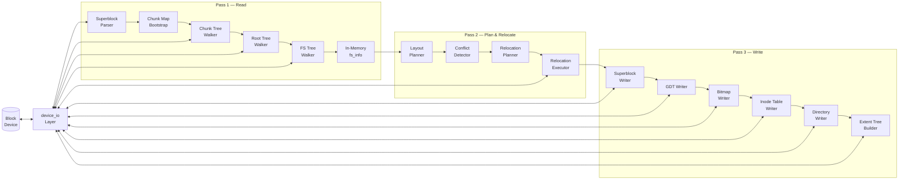

# TECHNICAL.md — btrfs2ext4 Internals

This document describes the core philosophy, architecture, data flow, algorithms, and key design decisions inside `btrfs2ext4`. It is intended for contributors, auditors, and anyone who wants to understand _how_ the converter works at a deep technical level.

---

## Table of Contents

1. [Project Motivation & Core Philosophy](#1-project-motivation--core-philosophy)
2. [Architecture Overview](#2-architecture-overview)
3. [Conversion Pipeline (3-Pass)](#3-conversion-pipeline-3-pass)
4. [Pass 1 — Btrfs Metadata Reader](#4-pass-1--btrfs-metadata-reader)
5. [Pass 2 — Ext4 Layout Planner & Block Relocator](#5-pass-2--ext4-layout-planner--block-relocator)
6. [Pass 3 — Ext4 Metadata Writer](#6-pass-3--ext4-metadata-writer)
7. [Core Data Structures](#7-core-data-structures)
8. [Performance Optimisations](#8-performance-optimisations)
9. [Crash-Recovery Journal](#9-crash-recovery-journal)
10. [Rollback Mechanism](#10-rollback-mechanism)
11. [Device I/O Layer](#11-device-io-layer)
12. [Current Limitations & Future Work](#12-current-limitations--future-work)

---

## 1. Project Motivation & Core Philosophy

Before diving into the codebase, it is essential to understand _why_ `btrfs2ext4` was built the way it is. The project originated from a personal need to convert a massive, heavily fragmented Btrfs filesystem to Ext4 **in-place**, on hardware with severe constraints (limited RAM, a slow mechanical hard drive, and running on a laptop). There was no spare drive available to copy the data out.

Because of these constraints, the core philosophy of this tool is **Predictability and Safety over raw speed**. Every architectural decision reflects this reality:

- **Zero-Copy In-Place Conversion:** The tool mathematically calculates and proves that the new Ext4 metadata can fit alongside the existing Btrfs data, relocating only the blocks that strictly collide.
- **Bounded Memory Guarantees:** Scanning millions of inodes on limited RAM normally triggers the kernel's Out-Of-Memory (OOM) killer. This dictated the implementation of `mmap()`-backed swap files for huge structures.
- **Hardware-Defensive Engineering:** Features like the _Bloom Filter Fallback_ (to prevent HDD thrashing), sequential I/O linearization, and _The Viability Audit_ (checking laptop battery levels and exact physical block expansions) were directly inspired by the failures of executing this on older hardware.

The architecture is built to ensure the conversion survives the worst-case scenarios.

---

## 2. Architecture Overview



The converter runs as a single-threaded user-space process. All I/O goes through the `device_io` abstraction, which supports both real block devices (via `BLKGETSIZE64` ioctl) and regular image files.

---

## 3. Conversion Pipeline (3-Pass)

The top-level entry point is `btrfs2ext4_convert()` in `main.c`. It orchestrates three sequential passes:

| Pass  | Function                                                          | What it does                                                                                          |
| ----- | ----------------------------------------------------------------- | ----------------------------------------------------------------------------------------------------- |
| **1** | `btrfs_read_fs()`                                                 | Parse Btrfs superblock, chunk tree, root tree, and FS tree into an in-memory `btrfs_fs_info`          |
| **2** | `ext4_plan_layout()` + `relocator_plan()` + `relocator_execute()` | Compute the Ext4 block-group layout, identify data/metadata conflicts, relocate colliding data blocks |
| **3** | `ext4_write_*()` functions                                        | Write the Ext4 superblock, GDT, bitmaps, inode tables, directories, and extent trees                  |

---

## 4. Pass 1 — Btrfs Metadata Reader

### 4.1 Superblock parsing (`superblock.c`)

1. Read 4 KiB at offset `0x10000` (the primary Btrfs superblock).
2. Validate the magic number (`_BHRfS_M` little-endian).
3. Verify the CRC32C checksum (Castagnoli polynomial `0x82F63B78`) over everything after the 32-byte `csum` field.
4. Enforce v1 constraints: sector size = 4096, single-device only, CRC32C checksum type.

### 4.2 Chunk tree bootstrap (`chunk_tree.c`)

Btrfs stores a bootstrap copy of system-chunk mappings inside the superblock's `sys_chunk_array[]` (up to 2048 bytes). These provide the minimum logical→physical mappings needed to read the chunk tree itself.

1. Parse `sys_chunk_array`: each entry is a `btrfs_disk_key` + `btrfs_chunk` + `num_stripes × btrfs_stripe`.
2. For single-device, take `stripe[0].offset` as the physical address.
3. Sort entries by logical address for binary search.

### 4.3 Chunk tree walk (`chunk_tree.c`)

Walk the chunk tree (rooted at `sb.chunk_root`) to populate **all** chunk mappings — data, metadata, and system.

- Uses an explicit stack-based DFS (not recursion) to avoid stack overflow on deep trees.
- After completion, re-sorts and deduplicates the chunk map.

### 4.4 Address resolution (`chunk_map_resolve()`)

Binary search over the sorted `chunk_map` entries. For a logical address `L`:

```
physical = entry.physical + (L − entry.logical)
```

Returns `(uint64_t)-1` if no mapping contains `L`.

### 4.5 Root tree walk (`fs_tree.c`)

Walk the root tree (rooted at `sb.root`) to find the FS tree root (`objectid = 5`, `BTRFS_ROOT_ITEM_KEY`). This gives the logical byte-address and level of the FS tree's root node.

### 4.6 FS tree walk (`fs_tree.c`)

Walk the FS tree using the generic `btree_walk()` function. For each leaf item, a callback dispatches on the key type:

| Key Type                | Action                                                                           |
| ----------------------- | -------------------------------------------------------------------------------- |
| `BTRFS_INODE_ITEM_KEY`  | Create/update a `file_entry`: mode, uid, gid, nlink, size, timestamps            |
| `BTRFS_INODE_REF_KEY`   | Set the entry's parent inode and filename                                        |
| `BTRFS_DIR_INDEX_KEY`   | Link child → parent in the directory tree (avoids hash collisions of `DIR_ITEM`) |
| `BTRFS_EXTENT_DATA_KEY` | Add a `file_extent` (inline data, regular extent, or prealloc)                   |

After traversal, symlink targets are extracted from inline extent data, and the root directory is identified as inode 256.

### 4.7 Generic B-tree walker (`btree.c`)

An iterative DFS that:

1. Reads a node via `device_read()` after resolving its logical address through the chunk map.
2. Validates the `bytenr` field matches the expected logical address.
3. For internal nodes: issues `posix_fadvise(POSIX_FADV_WILLNEED)` readahead hints for all children before pushing them in reverse order (for correct DFS ordering).
4. For leaf nodes: iterates each `btrfs_item`, validates data bounds, and invokes the user callback.

Stack capacity: 8192 entries (conservative upper bound for 8 levels × ~493 key-pointers per 16 KiB node).

---

## 5. Pass 2 — Ext4 Layout Planner & Block Relocator

### 5.1 Layout planner (`planner.c`)

`ext4_plan_layout()` computes the full block-group geometry:

```
blocks_per_group = 8 × block_size          (= 32 768 for 4 KiB blocks)
num_groups       = ⌈total_blocks / blocks_per_group⌉
inodes_per_group = ⌈device_size / inode_ratio / num_groups⌉, rounded up to × 8
```

For each block group, it lays out structures sequentially:

```
┌───────────┬─────┬──────────────┬──────────────┬──────────────┬──────────────┬───────────┐
│ Superblock│ GDT │ Reserved GDT │ Block Bitmap │ Inode Bitmap │ Inode Table  │ Data…     │
│ (group 0, │     │ (for growth) │ (1 block)    │ (1 block)    │ (N blocks)   │           │
│  1, 3^n,  │     │              │              │              │              │           │
│  5^n, 7^n)│     │              │              │              │              │           │
└───────────┴─────┴──────────────┴──────────────┴──────────────┴──────────────┴───────────┘
```

Every non-data block is appended to the `reserved_blocks[]` array (a flat list of block numbers) for use by the conflict detector.

**Deadlock & Hardware Pre-Calculation Engine (`The Viability Audit`)**:
`planner.c` executes an exact calculation of physically required bounds mapping everything from symlinks > 59 bytes to B-Tree index routing nodes. It precisely calculates _decompression inflation_ of compressed blocks and strictly anticipates the extra block requirements of _Physical CoW Deduplication Cloning_. If the available free data blocks cannot satisfy the total expanded footprint, or if the host device is a laptop running on battery power below 20%, the system forcefully aborts the conversion. This safeguards against in-flight crashes due to 100% full drives or sudden power-loss.

The `sparse_super` feature is applied: superblock + GDT copies exist only in groups 0, 1, and powers of 3, 5, and 7 (function `ext4_bg_has_super()`).

### 5.2 Conflict detection (`planner.c` — `ext4_find_conflicts()`)

For each Btrfs data extent, resolve its physical block range and check whether any block overlaps with the `reserved_blocks[]` list. This is the count of extents that must be relocated.

### 5.3 Relocation planner (`relocator.c` — `relocator_plan()`)

1. **Build a conflict bitmap** — one bit per block on the entire device. Populate from `reserved_blocks[]`. This turns the O(N×M) per-block check into O(1).

2. **Build a free-space tracker** — scan all blocks, mark those used by either Ext4 metadata or Btrfs data extents, and collect the remaining ones into a sorted array of free block numbers.

3. **Find and coalesce conflicting runs** — for each Btrfs extent, scan its block range for contiguous runs of conflicting blocks. For each run:
   - Attempt to allocate a consecutive run of free blocks (`free_space_alloc_run()`).
   - If consecutive allocation fails, fall back to single-block allocations.
   - Emit a `relocation_entry` per run (or per individual block if the run is fragmented).

### 5.4 Relocation executor (`relocator.c` — `relocator_execute()`)

For each relocation entry:

1. **Read** the source data (possibly multi-block).
2. **CRC32C** the data.
3. **Write** to the destination.
4. **Verify**: read-back and compare CRC32C (catches silent write corruption).
5. **Update in-memory extent maps** via a hash table mapping `physical_offset → (inode_idx, extent_idx)`. This avoids the previous O(inodes × extents) linear scan.
6. **CoW Resolving**: For duplicate extents (Copy-on-Write clones from snapshots), the `extent_hash` tracking identifies shared logical boundaries. `btrfs2ext4` safely resolves multiple source logical mappings by physically allocating new Ext4 blocks and copying the data over, ensuring `e2fsck` does not report "Multiply-Claimed Blocks" corruption.
7. Mark the entry as completed.

All moved data is also backed by the Btrfs superblock backup (see §10) so the original filesystem can be restored.

---

## 6. Pass 3 — Ext4 Metadata Writer

### 6.1 Superblock (`superblock_writer.c`)

Writes a fully populated `ext4_super_block` at byte offset 1024 (the primary copy) and at the start of every block group with `has_super = true`. Key fields:

- **Feature flags**: `FILETYPE | EXTENTS | 64BIT | FLEX_BG` (incompat), `SPARSE_SUPER | LARGE_FILE | HUGE_FILE | GDT_CSUM | DIR_NLINK | EXTRA_ISIZE` (ro_compat), `EXT_ATTR | DIR_INDEX | RESIZE_INODE` (compat).
- **No journal** — the output is intentionally ext2-compatible so `tune2fs -j` can add a journal after `e2fsck -f`.
- **UUID**: freshly generated.
- **Volume name**: copied from the Btrfs label (up to 16 chars).
- **Flex BG**: 16 groups per flex (log₂ = 4).

### 6.2 Group Descriptor Table (`gdt_writer.c`)

For each block group, fills an `ext4_group_desc` (64 bytes in 64-bit mode) with bitmap/inode-table block pointers and initial free counts. The GDT is replicated to every block group that has a superblock backup.

### 6.3 Bitmaps (`bitmap_writer.c`)

- **Block bitmaps**: marks metadata blocks (superblock, GDT, reserved GDT, bitmaps, inode table) as used. Also marks blocks beyond the device end in the last partial group.
- **Inode bitmaps**: marks reserved inodes 1–10 as used in group 0.

### 6.4 Inode table & inode mapping (`inode_writer.c`)

1. **Inode number assignment**:
   - Btrfs root directory (inode 256) → Ext4 inode 2 (`EXT4_ROOT_INO`)
   - All other inodes → sequential from 11 (`EXT4_GOOD_OLD_FIRST_INO`)

2. **Hash table**: after assignment, a hash table (Knuth multiplicative hash, 2× over-provisioned) is built for O(1) lookups during directory and extent writing.
   - **Mmap Swap Scaling**: Because systems with >10 million inodes easily exceed limited RAM sizes, the hash structures automatically detect if space exceeds the adaptive `mmap_threshold` (bounded by default to 60% of total system RAM). If exceeded, `inode_map` seamlessly triggers a `mmap()`-backed unbuffered temporary SSD paging file (`.btrfs2ext4.tmp.entries`), guaranteeing bounded usage no matter how massive the layout is.
   - **Bloom Filter Fallback**: To prevent intense mechanical hard drive thrashing (O(N) latency spikes) when reading `.tmp` lookup misses, a probabilistic Bloom Filter bounds the active memory footprint, instantly pre-verifying if an `inode` is structurally present before hitting the `mmap()` page cache.

3. **Inode translation**: for each Btrfs `file_entry`, an `ext4_inode` (256 bytes) is populated:
   - `i_mode`, `i_uid`/`i_gid` (hi + lo), `i_links_count`, `i_size` (64-bit)
   - Timestamps: `i_atime`, `i_ctime`, `i_mtime`, `i_crtime` with nanosecond extra fields
   - `i_blocks` in 512-byte sectors
   - Extent tree (see §6.6)
   - **Native Ext4 Inline Data**: For small files `<60 bytes` long, they are injected directly inside `i_block`, bypassing extent block allocations tree completely (`EXT4_INLINE_DATA_FL`). For bytes `60-150`, remainder data is appended into the inode's trailing residual bounds via a `system.data` XAttr pointer.
   - **Extended Attributes (Xattrs)**: Btrfs `BTRFS_XATTR_ITEM_KEY` metadata is parsed out and reserialized into standard Ext4 `ext4_xattr_ibody_header` structs (Security, System, User keys) fitted snugly into the tail of the 256-byte inode framework.

4. **Special inodes**:
   - **Symlinks ≤ 59 bytes**: stored directly in `i_block[]` (fast symlink)
   - **Symlinks > 59 bytes**: allocated a data block, referenced by a single-extent tree
   - **Device nodes**: `rdev` encoded in `i_block[0]` (old) and `i_block[1]` (new) format

### 6.5 Directories (`dir_writer.c`)

For each directory inode:

1. Allocate blocks via `ext4_alloc_block()`.
2. Write `.` and `..` entries, then child entries. Each `ext4_dir_entry_2` is 4-byte aligned.
3. The last entry's `rec_len` is extended to fill the remainder of the block.
4. **HTree Generation**: If entries overflow the standard 4KiB block, the directory undergoes a full `Ext4 2-Level HTree` indexing. Legacy hashes are generated off the decouple `dir_entry_link` maps, dot entries are assigned to block 0, and subsequent nodes are spun up as a 2-level B-Tree branch structure with `indirect_levels = 1`, supporting potentially millions of directory entries without arbitrarily degrading I/O limits.
5. The inode's `i_block[]` is updated with an inline extent tree pointing to the directory's data blocks.

File-type translation: `btrfs_to_ext4_filetype()` maps POSIX `S_IS*()` modes to `EXT4_FT_*` constants.

### 6.6 Extent tree builder (`extent_writer.c`)

For each regular file:

1. **Resolve & merge**: translate each Btrfs extent's logical `disk_bytenr` to a physical block via the chunk map. Sort by file block, merge adjacent/contiguous extents. Split any extent > 32 768 blocks (Ext4 max `ee_len`).

2. **Inline tree** (≤ 4 extents): header + up to 4 `ext4_extent` entries fit in `i_block[60]`.

3. **Multi-level tree** (> 4 extents): a general bottom-up N-depth builder. The algorithm:
   1. Build depth-0 leaf blocks, each holding up to 340 `ext4_extent` entries (for 4 KiB blocks).
   2. While the current level has more nodes than fit in the inode root (4), group them into index blocks (each holding up to 340 `ext4_extent_idx` entries) and increment depth.
   3. Write the final top-level pointers as the inode root index.

   | Depth      | Max extents per file   |
   | ---------- | ---------------------- |
   | 0 (inline) | 4                      |
   | 1          | 4 × 340 = 1 360        |
   | 2          | 4 × 340² = 462 400     |
   | 3          | 4 × 340³ ≈ 157 million |

   The depth is chosen automatically per-file — small files get inline trees, massively fragmented files get deeper trees. Files that require depth > 1 produce a log message during conversion.

### 6.7 Block allocator (`extent_writer.c`)

A sequential allocator with O(1) reserved-block checks:

1. `ext4_block_alloc_init()`: builds a bitmap from `reserved_blocks[]`.
2. `ext4_alloc_block()`: scans data regions forward from a cursor, skipping reserved blocks via bitmap test. Falls back to the linear scan if the bitmap allocation fails.

---

## 7. Core Data Structures

### Btrfs side

| Structure                      | File                 | Description                                                                            |
| ------------------------------ | -------------------- | -------------------------------------------------------------------------------------- |
| `btrfs_super_block`            | `btrfs_structures.h` | 4 KiB on-disk superblock (packed)                                                      |
| `btrfs_header`                 | `btrfs_structures.h` | B-tree node header (101 bytes)                                                         |
| `btrfs_key_ptr`                | `btrfs_structures.h` | Internal node child pointer (33 bytes)                                                 |
| `btrfs_item`                   | `btrfs_structures.h` | Leaf node item header (25 bytes)                                                       |
| `btrfs_file_extent_item`       | `btrfs_structures.h` | File extent descriptor                                                                 |
| `btrfs_chunk` + `btrfs_stripe` | `btrfs_structures.h` | Chunk mapping with stripe info                                                         |
| `chunk_map` / `chunk_mapping`  | `chunk_tree.h`       | In-memory sorted array of logical→physical mappings                                    |
| `btrfs_fs_info`                | `btrfs_reader.h`     | Complete in-memory FS state (superblock, chunk map, inode table, used-block map)       |
| `file_entry`                   | `btrfs_reader.h`     | In-memory inode: metadata + extents + children + symlink target                        |
| `dir_entry_link`               | `btrfs_reader.h`     | Edge coupling separating name bindings directly to dir relationships for hardlinks     |
| `file_extent`                  | `btrfs_reader.h`     | In-memory extent: file offset, disk byte address, sizes, compression type, inline data |

### Ext4 side

| Structure                                                | File                | Description                                            |
| -------------------------------------------------------- | ------------------- | ------------------------------------------------------ |
| `ext4_super_block`                                       | `ext4_structures.h` | 1 KiB on-disk superblock (packed)                      |
| `ext4_group_desc`                                        | `ext4_structures.h` | 64-byte block-group descriptor (64-bit mode)           |
| `ext4_inode`                                             | `ext4_structures.h` | 256-byte inode with extent-tree root in `i_block[60]`  |
| `ext4_extent_header` / `ext4_extent` / `ext4_extent_idx` | `ext4_structures.h` | Extent tree nodes                                      |
| `ext4_dir_entry_2`                                       | `ext4_structures.h` | Variable-length directory entry                        |
| `ext4_layout` / `ext4_bg_layout`                         | `ext4_planner.h`    | In-memory block-group geometry and reserved-block list |
| `inode_map` / `inode_map_entry`                          | `ext4_writer.h`     | Btrfs→Ext4 inode-number mapping with hash table        |

### Relocation

| Structure                           | File          | Description                                                                                       |
| ----------------------------------- | ------------- | ------------------------------------------------------------------------------------------------- |
| `relocation_entry`                  | `relocator.h` | One move operation: src/dst offsets, length, CRC, sequence number                                 |
| `relocation_plan`                   | `relocator.h` | Array of entries + total bytes counter                                                            |
| `extent_hash` / `extent_hash_entry` | `relocator.c` | Hash table mapping physical byte offset → (inode index, extent index) for O(1) extent-map updates |
| `free_space`                        | `relocator.c` | Sorted array of free block numbers with allocation cursor                                         |

---

## 8. Performance Optimisations

A number of critical optimisations have been extensively implemented:

### #4 — Conflict bitmap (`relocator.c`)

**Problem**: checking whether a block conflicts with Ext4 metadata required scanning the entire `reserved_blocks[]` array — O(M) per block, O(N×M) total.

**Solution**: build a single bitmap (1 bit per block) at the start of `relocator_plan()`. Each check becomes `bitmap[block/8] >> (block%8) & 1` — O(1).

### #3 — Hash inode map (`inode_writer.c`)

**Problem**: looking up an Ext4 inode number from a Btrfs inode number was a linear scan — O(N) per lookup, O(N²) total.

**Solution**: after all mappings are added, `inode_map_build_hash()` builds a hash table with open addressing (Knuth multiplicative hash `key * 2654435761`, 2× over-provisioned). Average lookup is O(1).

### #2 — Coalesced relocations (`relocator.c`)

**Problem**: each conflicting block generated a separate read-write cycle.

**Solution**: scan for contiguous runs of conflicting blocks and allocate a destination run in one call. This produces a single large `device_read()` + `device_write()` instead of many small ones, reducing syscall overhead and enabling the kernel's I/O scheduler to batch operations.

### #7 — Extent hash for relocation updates (`relocator.c`)

**Problem**: after relocating a block, the converter had to find the corresponding `file_extent` by scanning all inodes and extents — O(I × E) per relocation.

**Solution**: build a hash table mapping `physical_block_offset → (inode_idx, extent_idx)` before execution begins. Each extent update is then O(1).

### #11 — Bitmap block allocator (`extent_writer.c`)

**Problem**: `ext4_alloc_block()` checked each candidate block against `reserved_blocks[]` linearly — O(R) per allocation.

**Solution**: `ext4_block_alloc_init()` builds a reserved-block bitmap. Each allocation check is a single bit test — O(1).

### #12 — B-tree readahead hints (`btree.c`)

**Problem**: B-tree traversal read nodes one at a time; the kernel had no opportunity to prefetch.

**Solution**: before descending into an internal node's children, issue `posix_fadvise(POSIX_FADV_WILLNEED)` for every child's physical address. The kernel starts reading them in the background while the current child is being processed.

### #14 — Bloom Filter Fallback (`bloom.c`)

**Problem**: Extreme layouts that exhaust RAM trigger the `mmap` unbuffered temporary file sequence. Lookup _misses_ on `inode_hash_table` forced the operating system to issue 4 KiB random disk read `seek` spikes, drastically slowing mechanical disk geometry.

**Solution**: A fast memory-bounded probabilistic `bloom_filter` pre-verifies bounding lookups. Disk reads are only permitted if mathematically verified that the `btrfs_ino` is explicitly within the set preventing HDD thrashing on dense conversion cycles.

### #15 — Target Linearizer (`main.c`)

**Problem**: Btrfs naturally allocates inodes highly fragmented across its clustered metadata extents. If copied verbatim sequentially by node-discovery, the resulting Ext4 volume forces the operating system logic to skip randomly across the spinning disk bounds to serve file dependencies within the same directory.

**Solution**: A pre-computation `qsort` rearranges `btrfs2ext4` writing array pipelines primarily targeting layout assignments based on the bounding `parent_inode`. Subsequent Ext4 inode generation flows purely linearly clustering all deep directory sub-dependencies to perfectly sequential sectors immediately accelerating general layout tree indexing.

---

## 9. Crash-Recovery Journal

The journal (`journal.c`) provides a basic write-ahead log for block relocations:

```
┌─────────────────────────┐
│ journal_header          │  Magic: "B2E4" (0x42324534)
│   magic, version,       │  State: CLEAN / IN_PROGRESS / ROLLBACK
│   entry_count, state,   │  CRC32C header checksum
│   journal_offset, csum  │
├─────────────────────────┤
│ relocation_entry[0]     │  src_offset, dst_offset, length,
│ relocation_entry[1]     │  checksum, seq, completed
│ …                       │
└─────────────────────────┘
```

**Protocol**:

1. `journal_init()` — write header with `state = IN_PROGRESS`.
2. Before each block move: `journal_log_move()` — append the entry.
3. After each verified move: `journal_mark_complete()` — set `completed = 1`.
4. On success: `journal_clear()` — set `state = CLEAN`.

**Recovery** (`journal_replay()`): on next startup, if `state == IN_PROGRESS`, iterate entries in reverse. For each completed entry, copy data back from `dst_offset` to `src_offset` (undo), then clear the journal.

---

## 10. Rollback Mechanism

Before any block relocations, `btrfs2ext4_convert()` copies the original Btrfs superblock to the last aligned 4 KiB slot on the device:

```
backup_offset = (device_size − 4096) & ~4095
```

`btrfs2ext4_rollback()` reads this backup, verifies its `BTRFS_MAGIC`, and writes it back to `0x10000`. After rollback, `btrfs check` should be run to verify integrity, since relocated data blocks remain at their new positions.

---

## 11. Device I/O Layer

`device_io.c` wraps POSIX I/O:

| Function         | Implementation                                                                                              |
| ---------------- | ----------------------------------------------------------------------------------------------------------- |
| `device_open()`  | `open()` with `O_RDONLY` (dry-run) or `O_RDWR`. Uses `BLKGETSIZE64` for block devices, `fstat()` for files. |
| `device_read()`  | Loop of `pread()` calls until exactly `size` bytes are read. Returns `-1` on read-past-end.                 |
| `device_write()` | Loop of `pwrite()` calls. Fails if opened read-only.                                                        |
| `device_sync()`  | `fdatasync()` to flush kernel buffers.                                                                      |
| `device_close()` | `fsync()` + `close()`.                                                                                      |

All reads/writes use absolute byte offsets. Writes are automatically followed by `fdatasync()` when called through the journal (for durability), but not for every metadata write during Pass 3 (a final `device_sync()` is issued at the end).

---

## 12. Current Limitations & Future Work

### Limitations (v0.1.0-alpha)

- Single-device only (no multi-device / RAID)
- 4 KiB sector size only
- CRC32C checksums only (no xxhash / SHA-256 / BLAKE2)
- Max ~157 million extents per file (depth-3 tree; depth chosen automatically)

### Planned optimisations (not yet implemented)

| #   | Optimisation                      | Expected impact                                  |
| --- | --------------------------------- | ------------------------------------------------ |
| 1   | Vectored I/O (`preadv`/`pwritev`) | Reduced syscall count for multi-block operations |
| 5   | `mmap()` for metadata read        | Faster Btrfs tree traversal on large filesystems |
| 6   | Asynchronous I/O (`io_uring`)     | Overlapped read/write during relocation          |
| 9   | Parallel inode table write        | Multi-threaded Pass 3 for multi-core CPUs        |
