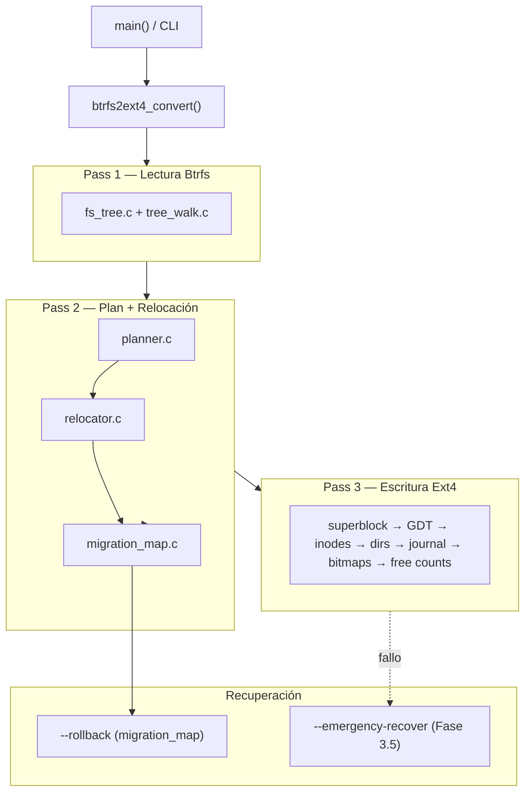
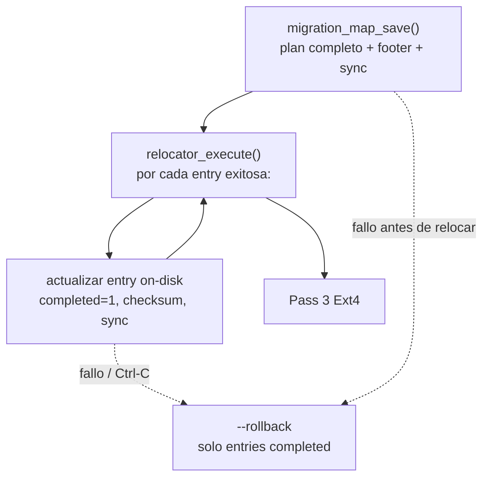
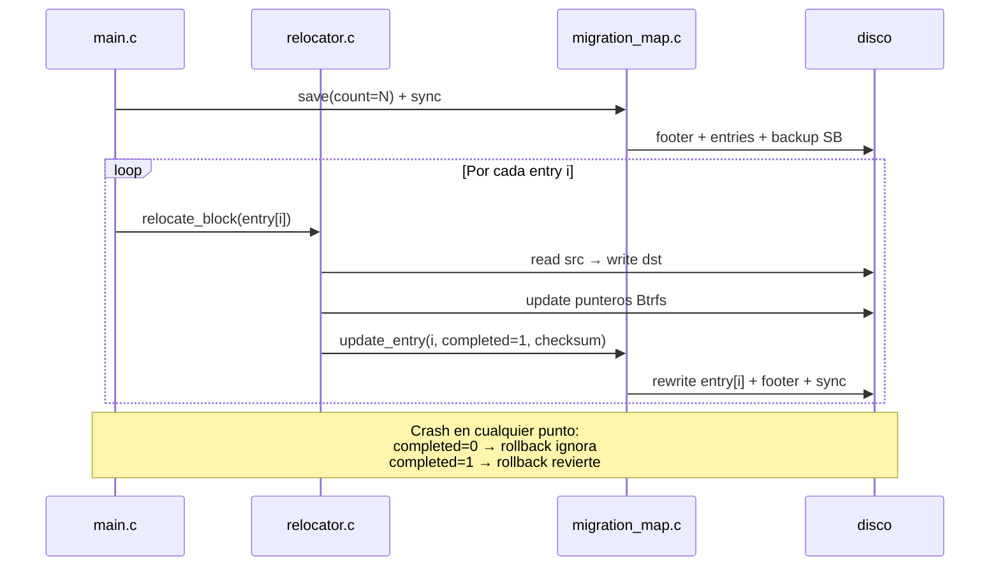

# Plan de implementación — btrfs2ext4

Documento maestro de estabilización y corrección del conversor in-place Btrfs → Ext4.

Refleja el análisis profundo del código, las fases ejecutadas (best-of-N) y el roadmap pendiente.

**Última actualización:** 2026-06-11  

**Rama de referencia:** `cursor/implementation-complete`  

**Estado del proyecto:** `0.3.0-dev` (main congelado hasta merge final)

---

## Tabla de contenidos

1. [Resumen ejecutivo](#1-resumen-ejecutivo)

2. [Arquitectura y flujo](#2-arquitectura-y-flujo)

3. [Fase 0 — Fundamentos](#fase-0--fundamentos) ✅

4. [Fase 1 — Integridad Ext4 (P0)](#fase-1--integridad-ext4-p0) ✅

5. [Fase 2 — Lector Btrfs](#fase-2--lector-btrfs) ✅

6. [Fase 3 — Recuperación Pass 2 (Opción A+)](#fase-3--recuperación-pass-2-opción-a) ✅

7. [Fase 3.5 — Emergencia Pass 3](#fase-35--emergencia-pass-3) ✅

8. [Fase 4 — Planificación y espacio](#fase-4--planificación-y-espacio) ✅

9. [Fase 5 — Optimizaciones de rendimiento](#fase-5--optimizaciones-de-rendimiento) 🔲

10. [Fase 6 — Tests e infraestructura](#fase-6--tests-e-infraestructura) 🔲

11. [Fase 7 — API, CLI y limpieza](#fase-7--api-cli-y-limpieza) 🔲

12. [Métricas de éxito](#métricas-de-éxito)

13. [Decisiones de diseño registradas](#decisiones-de-diseño-registradas)

---

## 1. Resumen ejecutivo

`btrfs2ext4` convierte un filesystem Btrfs a Ext4 **in-place** en tres pasadas:

| Pasada | Función | Riesgo principal |

|--------|---------|------------------|

| **Pass 1** | Leer metadata Btrfs en memoria | Datos incorrectos por extents parciales / PREALLOC |

| **Pass 2** | Planificar layout Ext4 + relocar bloques en conflicto | Pérdida de datos si falla mid-relocation |

| **Pass 3** | Escribir estructuras Ext4 (superblock, GDT, inodos, bitmaps, dirs, journal) | Filesystem híbrido irrecuperable si se interrumpe |

### Problemas P0 aún abiertos (post Fase 2)

| # | Problema | Fase que lo resuelve |

|---|----------|---------------------|

| 1 | `migration_map_save(count=0)` no escribe footer ni hace sync | **Fase 3** |

| 2 | Alineación del mapa puede solapar footer | **Fase 3** |

| 3 | `journal.c` implementado pero nunca conectado (código muerto) | **Fase 3** (eliminar) |

| 4 | `check_battery_safe()` solo antes de Pass 3, no antes de relocación | **Fase 3** |

| 5 | Checksum por entrada no verificado en rollback | **Fase 3** §3.3, §3.7 |

| 6 | `completed=1` solo en RAM; rollback puede revertir moves incompletos | **Fase 3** §3.7 |

| 7 | `--rollback` no deshace metadata Ext4 de Pass 3 | **Fase 3.5** |

| 8 | Planner no reserva espacio para journal / HTree / CoW | Fase 4 |

| 9 | Sin test E2E Btrfs → convert → `e2fsck` | Fase 6 |

---

## 2. Arquitectura y flujo



### Archivos clave por subsistema

| Subsistema | Archivos |

|------------|----------|

| Orquestación | `src/main.c`, `include/btrfs2ext4.h` |

| Lector Btrfs | `src/btrfs/fs_tree.c`, `tree_walk.c`, `chunk_tree.c` |

| Planificador | `src/ext4/planner.c` |

| Escritor Ext4 | `src/ext4/inode_writer.c`, `dir_writer.c`, `bitmap_writer.c` |

| Relocación | `src/relocator.c`, `src/migration_map.c` |

| Journal (muerto) | `src/journal.c` — **a deprecar en Fase 3** |

| I/O | `src/device_io.c` |

| Tests | `tests/test_integration.c` (mejor cobertura) |

---

## Fase 0 — Fundamentos ✅

**Estado:** Completada `cursor/phase0-foundations-76a0`, PR #3)  

**Enfoque ganador:** Approach C + cherry-picks de A y B

| Tarea | Resultado |

|-------|-----------|

| CI GitHub Actions | Matrix GCC/Clang × Debug/Release, workflow reutilizable |

| Sanitizers | `BTRFS2EXT4_ENABLE_SANITIZERS` — ASan+UBSan en 4 tests |

| Bug `goto cleanup`/alloc | `struct convert_state` + `alloc_initialized` |

| Exit codes | API 0/-1, CLI 0/1 |

| Docs | [TECHNICAL.md](http://TECHNICAL.md), [CONTRIBUTING.md](http://CONTRIBUTING.md), CHANGELOG, README badge CI |

---

## Fase 1 — Integridad Ext4 (P0) ✅

**Estado:** Completada `cursor/phase1-foundations-76a0`, PR #4)  

**Enfoque ganador:** Approach B (full correctness)

| Tarea | Resultado |

|-------|-----------|

| Orden bitmaps Pass 3 | `ext4_finalize_bitmaps()` al final, tras dirs+journal |

| Directorios | Half-MD4, `INDEX_FL` solo HTree, metadata preservada |

| Checksums | METADATA_CSUM en superblock, GDT e inodos |

| Extents | `fi->offset`, bloques parciales, fallback físico post-relocación |

| Tests | E-4, E-5, E-6, Group J (37 tests integración) |

---

## Fase 2 — Lector Btrfs ✅

**Estado:** Completada `cursor/phase2-foundations-76a0`, PR #5)  

**Enfoque ganador:** Approach B (dynamic chunk_tree + fixes end-to-end)

| Tarea | Resultado |

|-------|-----------|

| PREALLOC | `btrfs_extent_is_sparse()` → holes; skip en pipeline |

| chunk_tree | `btrfs_tree_walk()` con stack dinámico y validación completa |

| OOM inline | Error propagado hasta `btrfs_read_fs` |

| CoW hash | Clave `(bytenr, num_bytes)` |

| METADATA_ITEM | `length = nodesize` |

| Coalescing | Guard con `offset != 0` |

| Tests | Group 11 (stress), fuzz, Group K (integration) |

---

## Fase 3 — Recuperación Pass 2 (Opción A+) 🔲

**Objetivo:** Hacer que `--rollback` funcione en **todos** los escenarios documentados de Pass 2, con un único mecanismo simple y mantenible.

### Decisión: Opción A+ — Solo `migration_map` (reforzado)

Se descartaron las opciones B (journal WAL) y C (dual layer) tras comparación:

| Criterio | Opción A ✅ | Opción B (journal) | Opción C (dual) |

|----------|------------|-------------------|-----------------|

| Complejidad | Baja | Media-alta | Alta |

| I/O en HDD | 1 sync al guardar mapa | 1 sync **por move** | Ambos |

| Recovery automático | No (manual `--rollback`) | Sí | Parcial |

| Mantenibilidad | **Alta** | Media | Baja |

| Código muerto | Elimina `journal.c` | Activa journal | Mantiene ambos |

| Adecuado para alpha | **Sí** | Marginal | No |

**Razón principal:** el `migration_map` ya está cableado en `main.c`; el journal tiene bugs latentes `seq` vs índice tras `qsort`, replay truncado a 16 MiB, nunca inicializado) y duplicaría la fuente de verdad.

### Por qué la Opción A puede ser robusta sin B ni C

La Opción B (journal WAL) y la Opción C (dual) intentan resolver **granularidad mid-relocation** añadiendo un segundo sistema. Eso introduce riesgos propios:

| Riesgo de B/C | Consecuencia |

|---------------|--------------|

| Dos fuentes de verdad (map + journal) | ¿Cuál manda si discrepan? |

| `fdatasync()` por cada move en HDD | Conversión multiplicada en tiempo; más puntos de fallo |

| Bugs latentes en `journal.c` | Recovery peor que sin journal |

| Complejidad operativa | Más difícil auditar para un proyecto alpha |

**La Opción A reforzada** logra la misma seguridad práctica **extendiendo el migration map** (un solo formato, un solo rollback) con:

1. **Checkpoint atómico** — footer + superblock backup + sync antes de cualquier write destructivo

2. **Progreso de relocación persistido** — campo `completed` y `checksum` actualizados on-disk tras cada move exitoso (sin journal separado)

3. **Rollback selectivo** — solo revierte entries con `completed == 1`

4. **Validación exhaustiva** — bounds, CRC, solapamientos, idempotencia

5. **Preflight** — verificar que el mapa cabe en la cola del disco antes de escribir

Esto **no es** la Opción B: no hay header journal separado, no hay `journal_log_move()` por syscall, no hay replay automático al reiniciar. Es el mismo `migration_map` con disciplina de escritura más estricta.



### Catálogo de edge cases

| # | Escenario | Estado actual | Riesgo | Mitigación (Opción A+) |

|---|-----------|---------------|--------|------------------------|

| E1 | `count=0`, crash en Pass 3 | Footer ausente → rollback falla | **Crítico** | §3.1 footer vacío + sync |

| E2 | Mapa grande, alineación `& ~4095` hacia abajo | Solapamiento mapa ↔ footer | **Crítico** | §3.2 redondeo hacia arriba + preflight |

| E3 | Crash **durante** `relocator_execute` | Mapa en disco tiene todos los moves; rollback revierte **todos**, incluso incompletos | **Crítico** | §3.7 progreso `completed` persistido |

| E4 | Move parcial (chunk a medias) | `src` intacto, `dst` con basura; rollback copia basura → `src` | **Crítico** | §3.7 solo revertir si `completed=1`; moves atómicos por entry |

| E5 | Checksum en mapa = 0 (guardado pre-execute) | Rollback no detecta corrupción en `dst` | Alto | §3.7 persistir checksum post-execute |

| E6 | Footer corrupto (CRC inválido) | Rollback podría actuar sobre datos basura | Alto | §3.3 rechazar footer; no tocar datos |

| E7 | `entry_count` malicioso en footer | OOM o read OOB | Alto | §3.3 cap 1M entries + validación bounds |

| E8 | `srcdst` + `length` fuera del device | Read/write OOB en rollback | Alto | §3.3 validar cada entry |

| E9 | Doble `--rollback` | Footer ya borrado; segundo intento falla | Bajo (OK) | §3.8 documentar; mensaje claro |

| E10 | Rollback con relocaciones + Pass 3 parcial | SB Btrfs restaurado pero metadata Ext4 persiste | Alto | **Fase 3.5** `--emergency-recover` |

| E11 | Plan con `srcdst` solapados | Corrupción silenciosa | Medio | §3.9 validar plan antes de execute |

| E12 | Tail del disco sin espacio para mapa+footer+backup | Write parcial | Alto | §3.9 preflight de espacio en cola |

| E13 | Batería baja solo chequeada pre-Pass 3 | Relocación destructiva sin AC | Alto | §3.4 battery antes de execute |

| E14 | `relocator_execute` falla; `journal_replay_partial` en offset 0 | Falsa sensación de recovery | Medio | §3.5 eliminar journal |

| E15 | CoW: mismo `src` en múltiples entries | Rollback inverso debe procesar en orden correcto | Medio | §3.8 rollback en orden inverso (ya existe) |

| E16 | Entry `length` > 1 GiB buffer rollback | Rollback usa buffer 1 MiB en loop (OK) pero execute cap 16 MiB | Bajo | §3.10 verificar consistencia de chunking |

| E17 | Usuario monta Btrfs tras rollback sin `btrfs check` | Metadatos inconsistentes | Medio | §3.8 mensaje post-rollback obligatorio |

| E18 | Imagen de archivo (no block device) | Mismo flujo; tamaño fijo | Bajo | Tests con archivo regular |

| E19 | Conversión reintentada sin rollback previo | Footer viejo + estado sucio | Alto | §3.8 detectar footer existente al inicio |

| E20 | `device_sync` falla tras escribir footer | Footer en cache, no en disco | Alto | §3.10 verificar retorno sync; abortar |

### Principios de robustez (Opción A+)

| Principio | Implementación |

|-----------|----------------|

| **Un solo mecanismo** | Todo recovery pasa por `migration_map_`*; sin journal paralelo |

| **Fail-closed** | Ante CRC inválido, bounds inválidos o sync fallido → abortar, no continuar |

| **Atomicidad por entry** | Un `relocation_entry` se completa entero o no se marca `completed` |

| **Sync mínimo viable** | Sync tras footer inicial + sync tras cada entry completada (coste aceptable vs. journal B) |

| **Idempotencia** | Segundo rollback = error claro; footer borrado al éxito |

| **Observabilidad** | Logs explícitos: entries completadas, omitidas en rollback, razón de rechazo |

| **Separación de fases** | Pass 2 recovery = `--rollback`; Pass 3 recovery = `--emergency-recover` (Fase 3.5) |

### Tareas de implementación

#### 3.1 Footer con `count=0` (CRÍTICO)

**Archivo:** `src/migration_map.c`

**Problema actual:**

```c

if (plan->count == 0)

    return 0;  // ← sale sin footer ni device_sync()

```

El comentario en `main.c:352` promete checkpoint de rollback, pero `migration_map_rollback()` requiere magic `B2E4MAP1` en el footer.

**Fix:**

- Con `count=0`: escribir footer con `entry_count=0`, magic válido, CRC32 del mapa vacío

- Llamar `device_sync()` siempre antes de retornar éxito

- El backup del superblock Btrfs ya se escribe (líneas 19–25); solo falta el footer

#### 3.2 Alineación del mapa (CRÍTICO)

**Archivo:** `src/migration_map.c:52–53`

**Problema:** `map_offset &= ~4095ULL` redondea **hacia abajo**, pudiendo solapar entries con la región del footer (8 KiB antes del backup).

**Fix:**

- Redondear `map_offset` **hacia arriba** al siguiente límite de 4 KiB

- Validar que `map_offset + map_size + MIGRATION_FOOTER_OFFSET <= backup_offset`

- Abortar con error claro si no cabe

#### 3.3 Validación en rollback (ALTO)

**Archivo:** `src/migration_map.c` — `migration_map_rollback()`

| Validación | Detalle |

|------------|---------|

| Bounds | `map_offset + map_size <= dev->size` |

| Entry checksum | Verificar `re->checksum` (CRC32C acumulado en `relocator_execute`) |

| Per-entry bounds | `src_offset + length <= dev->size`, idem `dst_offset` |

| Footer sanity | Rechazar `entry_count` absurdos aunque CRC del mapa pase |

#### 3.4 Seguridad operativa (ALTO)

**Archivo:** `src/main.c`

- Mover `check_battery_safe()` **antes** de `relocator_execute()` (no solo antes de Pass 3)

- Pass 2 con relocación es igual de destructivo que Pass 3 en términos de pérdida por corte de energía

#### 3.5 Limpieza de `journal.c` (MEDIO)

**Archivos:** `src/journal.c`, `include/journal.h`, `src/relocator.c:532`

| Acción | Detalle |

|--------|---------|

| Eliminar llamada a `journal_replay_partial()` en `relocator_execute` | Hoy lee offset 0 (inútil) |

| Opción preferida | Eliminar `journal.c` del build y marcar deprecated en [TECHNICAL.md](http://TECHNICAL.md) |

| Opción conservadora | Mantener archivo con `#if 0` y comentario "reservado para futuro" |

#### 3.7 Progreso incremental en el mapa `completed` on-disk) (CRÍTICO)

**Objetivo:** Cerrar el gap más grave de la Opción A actual: `re->completed=1` solo en RAM tras `relocate_block()`.

| Paso | Archivo | Cambio |

|------|---------|--------|

| 3.7.1 | `migration_map.c` | Nueva API `migration_map_update_entry(fd, index, entry)` — reescribe una entry + footer + `device_sync()` |

| 3.7.2 | `relocator.c` | Tras `relocate_block()` exitoso: set `completed=1`, calcular `checksum`, llamar `migration_map_update_entry` |

| 3.7.3 | `relocator.c` | Si `update_entry` falla: abort Pass 2 relocación (no continuar — estado inconsistente) |

| 3.7.4 | `main.c` | Al reanudar: `migration_map_load` → saltar entries con `completed=1` |

| 3.7.5 | `migration_map.c` | Rollback: revertir **solo** entries con `completed=1`; omitir el resto con log |

**Invariante:** En disco, `completed=1` implica que copy **y** update de punteros Btrfs terminaron para esa entry.

#### 3.8 Idempotencia y detección de estado previo (ALTO)

| Paso | Archivo | Cambio |

|------|---------|--------|

| 3.8.1 | `main.c` | Al inicio: detectar footer `B2E4MAP1` existente → rechazar conversión sin `--force` o sin `--rollback` previo |

| 3.8.2 | `migration_map.c` | Segundo `--rollback`: si footer ya borrado → exit 0 con mensaje "ya revertido" |

| 3.8.3 | `main.c` | Post-rollback: mensaje obligatorio recomendando `btrfs check` antes de montar |

| 3.8.4 | `migration_map.c` | Rollback en orden inverso de `seq` (ya existe); verificar que CoW multi-entry no rompe invariante |

#### 3.9 Validación del plan y preflight de espacio (ALTO)

| Paso | Archivo | Cambio |

|------|---------|--------|

| 3.9.1 | `migration_map.c` | `migration_map_validate_plan(entries, count, dev_size)` |

| 3.9.2 | Validación | Sin solapamiento `(dst_offset, dst_offset+length)` entre entries |

| 3.9.3 | Validación | Todo `src_offset + length ≤ dev_size` y `dst_offset + length ≤ dev_size` |

| 3.9.4 | Validación | Rechazar `src_offset == dst_offset` (no-op moves) |

| 3.9.5 | `main.c` | Preflight: `map_offset + map_size + footer + backup ≤ dev_size`; abortar si no cabe |

| 3.9.6 | `main.c` | Llamar validación tras planificar, **antes** de `migration_map_save` y `relocator_execute` |

#### 3.10 Sync, chunking y observabilidad (MEDIO)

| Paso | Archivo | Cambio |

|------|---------|--------|

| 3.10.1 | `migration_map.c` | Verificar retorno de `device_sync()` en `save` y `update_entry`; propagar errno y abortar |

| 3.10.2 | `main.c` | Log estructurado en Pass 2 relocación: `entry=i/total completed=M` |

| 3.10.3 | `relocator.c` | Alinear límites de chunking execute (16 MiB) vs rollback (1 MiB loop) — documentar o unificar |

| 3.10.4 | `journal.c` | Marcar `@deprecated` en [TECHNICAL.md](http://TECHNICAL.md); sin referencias activas en flujo principal |

| 3.10.5 | README | Recovery = migration map + `--rollback`; journal no soportado |



#### 3.11 Tests

##### Tests core

| ID | Test | Edge | Criterio |

|----|------|------|----------|

| T-3.1 | `test_migration_map_zero_entries` | E1 | `save(count=0)` → footer válido → `rollback()` exitoso |

| T-3.2 | `test_migration_map_alignment` | E2 | Mapas grandes no solapan footer |

| T-3.3 | `test_rollback_after_pass2` | E1 | Crash simulado post-save → `--rollback` OK |

| T-3.4 | `test_rollback_restores_superblock` | — | Magic Btrfs restaurado en `0x10000` |

| T-3.5 | `test_journal_deprecated` | E14 | Sin referencias activas a `journal.c` en flujo principal |

##### Tests de edge cases (robustez Opción A+)

| ID | Test | Edge | Criterio |

|----|------|------|----------|

| T-3.6 | `test_map_corrupt_magic` | E6 | `migration_map_load` → error claro, sin crash |

| T-3.7 | `test_map_corrupt_checksum` | E6 | Rechazo + mensaje "checksum mismatch" |

| T-3.8 | `test_map_truncated_footer` | E6 | `entry_count` inconsistente → error |

| T-3.9 | `test_map_entry_count_cap` | E7 | `entry_count > 1M` → rechazo |

| T-3.10 | `test_rollback_idempotent` | E9 | Segundo `--rollback` → exit 0, sin doble escritura |

| T-3.11 | `test_rollback_no_map` | E9 | Sin mapa → mensaje útil, exit ≠ 0 |

| T-3.12 | `test_relocate_crash_after_copy` | E3, E4 | Simular crash post-copy pre-update → rollback no revierte entry |

| T-3.13 | `test_relocate_crash_after_update` | E3 | `completed=1` en disco → rollback revierte |

| T-3.14 | `test_map_entry_oob` | E8 | Entry fuera de device → rechazo en validación |

| T-3.15 | `test_map_entry_overlap` | E11 | Plan con solapamiento dst → rechazo |

| T-3.16 | `test_map_out_of_space_preflight` | E12 | Plan que no cabe en cola → error antes de execute |

| T-3.17 | `test_map_persist_progress` | E3, E5 | Tras N moves, reload conserva `completed` y `checksum` de los N |

| T-3.18 | `test_map_entry_checksum_rollback` | E5 | Rollback rechaza entry con checksum corrupto en dst |

| T-3.19 | `test_double_convert_blocked` | E19 | Segunda conversión sin rollback → rechazo |

| T-3.20 | `test_sync_failure_propagates` | E20 | `device_sync` fallido → abort, mapa coherente |

| T-3.21 | `test_rollback_post_message` | E17 | Post-rollback imprime aviso `btrfs check` |

| T-3.22 | `test_large_entry_count` | E7 | 10k entries sintéticos: save/load sin OOM |

| T-3.23 | `test_image_file_device` | E18 | Mismo flujo con archivo regular de tamaño fijo |

| T-3.24 | `test_chunk_size_consistency` | E16 | Entry > 16 MiB: execute y rollback coherentes |

##### Matriz edge case → mitigación → test

| Edge | Mitigación (Opción A+) | Verificado por |

|------|------------------------|----------------|

| E1 | Footer + sync en `count=0` | T-3.1, T-3.3 |

| E2 | Alineación hacia arriba + preflight | T-3.2, T-3.16 |

| E3–E5 | `completed` + `checksum` persistidos | T-3.12, T-3.13, T-3.17, T-3.18 |

| E6–E8 | Validación estricta en load/rollback | T-3.6–T-3.9, T-3.14 |

| E9 | Rollback idempotente + mensajes | T-3.10, T-3.11 |

| E10 | — | **Fase 3.5** |

| E11–E12 | `migration_map_validate_plan()` + preflight | T-3.15, T-3.16 |

| E13 | Battery antes de `relocator_execute` | Manual + §3.4 |

| E14 | Deprecar journal | T-3.5 |

| E15 | Rollback orden inverso | T-3.13 (multi-entry) |

| E16 | Chunking consistente | T-3.24 |

| E17 | Mensaje post-rollback | T-3.21 |

| E18 | Archivo regular | T-3.23 |

| E19 | Detectar footer al inicio | T-3.19 |

| E20 | Propagación error sync | T-3.20 |

### Orden de implementación sugerido

```

3.1 Footer count=0        ← crítico, desbloquea rollback sin relocaciones

3.2 Alineación              ← crítico

3.7 Progreso completed      ← crítico, evita rollback de moves incompletos

3.4 Battery check           ← alto, cambio pequeño en main.c

3.3 Validación rollback     ← alto

3.9 Validación plan         ← alto

3.8 Idempotencia / estado   ← alto

3.10 Sync + observabilidad  ← medio

3.5 Limpieza journal        ← medio

3.11 Tests T-3.1–T-3.24     ← continuo (en paralelo con cada §)

```

### Criterios de aceptación (ampliados)

- [ ] `migration_map_save` con `count=0` escribe footer válido y `device_sync()`

- [ ] `--rollback` funciona tras Pass 2 completo (con y sin relocaciones)

- [ ] `--rollback` revierte **solo** entries con `completed=1` persistido en disco

- [ ] Tras cada relocación exitosa, `completed` y `checksum` persisten antes del siguiente move

- [ ] Crash simulado en cualquier punto de Pass 2 relocación deja mapa coherente (reload + rollback o resume)

- [ ] `migration_map_validate_plan()` rechaza solapamientos y rangos inválidos **antes** de execute

- [ ] Preflight de espacio en cola falla con mensaje accionable si el plan no cabe

- [ ] Segunda conversión sin rollback previo rechazada con mensaje claro

- [ ] `journal.c` no participa en el flujo de conversión

- [ ] Tests T-3.1–T-3.24 en verde en CI; sin regresiones en suite existente

- [ ] Ningún escenario E1–E20 queda sin mitigación asignada (E10 → Fase 3.5)

---

## Fase 3.5 — Emergencia Pass 3 🔲

**Objetivo:** Ofrecer una vía de recuperación cuando la conversión **falla o se interrumpe durante Pass 3**, escenario que la Fase 3 **no cubre**.

### Limitación que ninguna opción de Fase 3 resuelve

Si Pass 3 comienza (se escriben superblock, GDT, inodos, bitmaps, directorios o journal Ext4) y el proceso se interrumpe:

- El dispositivo queda en estado **híbrido** (metadata Ext4 parcial + datos Btrfs)

- `--rollback` restaura el superblock Btrfs pero **no borra** lo escrito en Pass 3

- `e2fsck` y `btrfs check` pueden fallar ambos

- El banner actual ya advierte: *"render the filesystem UNMOUNTABLE"*

La Fase 3.5 no pretende conversión perfecta post-crash, sino **detección de estado + protocolo de emergencia** para minimizar daño y guiar al usuario.

### Diseño: `conversion_state` en disco

Nuevo footer ligero en la cola del dispositivo (distinto del migration map), actualizado en cada hito de Pass 3:

```

[... datos ...][migration entries][migration footer][sb backup]

                      ↑

              (ya existe desde Fase 3)

Nuevo (Fase 3.5):

[...][CONVERT_STATE 64B][migration map...]

```

#### Estructura propuesta: `struct convert_state_footer`

```c

#define CONVERT_STATE_MAGIC "B2E4CVST"

struct convert_state_footer {

    char     magic[8];           /* "B2E4CVST" */

    uint32_t phase;              /* 0=idle, 2=pass2_done, 3=N (ver bitmask) */

    uint32_t pass3_step_mask;    /* bitmask de pasos Pass 3 completados */

    uint64_t timestamp;          /* CLOCK_REALTIME al último update */

    uint32_t crc32;

    uint32_t padding[9];

};

```

#### Bitmask de pasos Pass 3

| Bit | Paso |

|-----|------|

| `0x01` | Superblock escrito |

| `0x02` | GDT escrito |

| `0x04` | Inode tables escritas |

| `0x08` | Directorios escritos |

| `0x10` | Journal JBD2 escrito |

| `0x20` | Bitmaps finalizados |

| `0x40` | Free counts actualizados |

| `0x80` | Conversión completada (sync final) |

#### Flujo de actualización

```

migration_map_save()           → phase=2

ext4_write_superblock()        → set bit 0x01, sync footer

ext4_write_gdt()               → set bit 0x02, sync footer

... cada paso ...

device_sync() final           → set bit 0x80, phase=complete

```

Cada update hace `device_sync()` del footer (64 bytes — coste negligible).

### CLI de emergencia: `--emergency-recover`

Nueva opción en `btrfs2ext4.8` y `main.c`:

```

btrfs2ext4 --emergency-recover <device>

```

#### Comportamiento según estado detectado

| Estado detectado | Acción automática | Mensaje al usuario |

|------------------|-------------------|-------------------|

| Sin `CONVERT_STATE` ni `B2E4MAP1` | Salir con diagnóstico | "No hay conversión interrumpida" |

| Solo `B2E4MAP1`, phase≤2 | Ofrecer `--rollback` | "Ejecute: btrfs2ext4 --rollback DEVICE" |

| `B2E4MAP1` + Pass 3 iniciado (bits 0x01–0x3F) | **Modo emergencia** | Ver protocolo abajo |

| Bit 0x80 set (completo) | Salir | "Conversión ya completada; ejecute e2fsck -f" |

#### Protocolo de emergencia (Pass 3 interrumpido)

```

1. DETECTAR qué pasos de Pass 3 se completaron (bitmask)

2. ADVERTIR que el filesystem está en estado híbrido

3. INTENTAR rollback de relocaciones (--rollback parcial automático)

4. RESTAURAR superblock Btrfs desde backup

5. NO intentar montar Ext4

6. RECOMENDAR:

   a) btrfs scrub / btrfs check si se quiere volver a Btrfs

   b) ddrescue + reintentar conversión en copia si hay dudas

   c) Restaurar desde backup externo (siempre la opción segura)

```

**Importante:** la emergencia **no garantiza** datos intactos tras Pass 3 parcial. Su valor es:

1. **Diagnóstico claro** — el usuario sabe exactamente en qué paso falló

2. **Mejor esfuerzo de rollback** — revierte relocaciones + restaura SB Btrfs automáticamente

3. **Evita fsck ciego** — instrucciones explícitas según estado

4. **Base para resume futuro** — la bitmask permite implementar `--resume` en una fase posterior

### Tareas de implementación

| # | Tarea | Archivo(s) |

|---|-------|------------|

| 3.5.1 | Definir `convert_state_footer` y API save/load | `include/convert_state.h`, `src/convert_state.c` |

| 3.5.2 | Actualizar footer tras cada paso Pass 3 | `src/main.c` |

| 3.5.3 | Implementar `--emergency-recover` | `src/main.c`, `btrfs2ext4.8` |

| 3.5.4 | Integrar con `migration_map_rollback()` | `src/convert_state.c` |

| 3.5.5 | Limpiar footer al completar conversión exitosa | `src/main.c` (post sync final) |

| 3.5.6 | Tests: simular crash en cada paso Pass 3 | `tests/test_integration.c` |

| 3.5.7 | Documentar en [TECHNICAL.md](http://TECHNICAL.md) §10 y README | docs |

### Criterio de aceptación

- Tras interrumpir Pass 3 simulado en paso GDT: `--emergency-recover` reporta bit `0x02`, ejecuta rollback, restaura SB Btrfs

- Tras conversión exitosa: footer `CONVERT_STATE` ausente o marcado completo

- `ctest` 4/4 verde

### Dependencias

- **Requiere Fase 3 completada** (footer migration map con `count=0` funcional)

- Independiente de journal.c (no se usa)

---

## Fase 4 — Planificación y espacio 🔲

**Objetivo:** Evitar conversiones que abortan a mitad por falta de espacio.

| Tarea | Archivo |

|-------|---------|

| Reservar bloques para journal (4–128 MiB) | `planner.c` |

| Presupuestar bloques HTree para directorios grandes | `planner.c` |

| Incluir `dedup_blocks_needed` y CoW clones en viabilidad | `main.c`, `planner.c` |

| Margen de seguridad configurable (hoy 5% fijo) | `planner.c`, CLI |

---

## Fase 5 — Optimizaciones de rendimiento ✅

**Estado:** Completada `cursor/phase5-approach-c-76a0`  

**Enfoque ganador:** Approach C (producer-consumer pipeline + unified mem_tracker)

| Tarea | Resultado |
|-------|-----------|
| Pass 3 `inode_writer` | Pipeline: thread_pool decompress + main io_uring batch writes |
| Pass 2 `relocator` | Async queue 2×16MiB double-buffer; prefetch read overlaps write |
| `mem_tracker` | Unified API: `mem_config` + allocation tracking |
| `free_space_init` | Lazy sparse bitmap for TB+ volumes (chunked on demand) |
| Preservado | `migration_map_update_entry`, checksum, `completed` por entry |

---

## Fase 6 — Tests e infraestructura 🔲

**Objetivo:** Detectar regresiones automáticamente.

| Test | Prioridad |

|------|-----------|

| E2E: `mkfs.btrfs` → convert → `e2fsck -f` | **P0** |

| Rollback tras crash simulado Pass 2 y Pass 3 | **P0** |

| Integrar `frag_simulator.sh` en CTest | Media |

| Fuzz real (libFuzzer/AFL) en `btree_walk` | Baja |

---

## Fase 7 — API, CLI y limpieza 🔲

| Tarea | Detalle |

|-------|---------|

| `verbose` | Implementar o eliminar flag y documentación |

| `no_journal` | Implementar o eliminar de `convert_options` |

| `ext4_write_filesystem()` | Wrapper de Pass 3 (API declarada, no implementada) |

| Validar `inode_ratio` en CLI | Mínimo/máximo |

| Alinear `-m` con man page | MB vs % de RAM |

---

## Métricas de éxito

| Métrica | Antes | Objetivo final |

|---------|-------|----------------|

| `e2fsck -f` post-conversión | Falla en casos con dirs/journal | 100% limpio en suite E2E |

| `--rollback` tras crash Pass 2 | Roto con 0 relocaciones | Siempre funcional; solo revierte moves completados (Fase 3 A+) |

| Cobertura edge cases Fase 3 | Sin catálogo ni tests | E1–E20 mitigados + T-3.1–T-3.24 (Fase 3 A+) |

| `--emergency-recover` tras crash Pass 3 | No existe | Diagnóstico + mejor esfuerzo (Fase 3.5) |

| CI | Ausente | Verde en main (Fase 0 ✅) |

| Cobertura E2E | 0 tests pipeline completo | ≥1 por tipo de archivo (Fase 6) |

---

## Decisiones de diseño registradas

| Fecha | Decisión | Alternativas descartadas | Razón |

|-------|----------|-------------------------|-------|

| 2026-06 | Fase 0: Approach C + cherry-picks | A (matrix simple), B (minimal CI) | `convert_state` + CI reutilizable |

| 2026-06 | Fase 1: Approach B | A (minimal), C (two-phase bitmap) | Half-MD4 correcto, METADATA_CSUM completo |

| 2026-06 | Fase 2: Approach B | A (guards mínimos), C (walker roto en fuzz) | `tree_walk.c` compartido, PREALLOC end-to-end |

| 2026-06 | **Fase 3: Opción A+** | B (journal WAL), C (dual) | Un solo mecanismo + edge cases E1–E20 sin journal paralelo |

| 2026-06 | **Fase 3.5: emergencia Pass 3** | Resume Pass 3, imagen intermedia | Menor alcance; diagnóstico + rollback automático |

---

## Roadmap visual

```

[Fase 0] ✅ CI + sanitizers + convert_state + exit codes

[Fase 1] ✅ Bitmaps + directorios + checksums Ext4

[Fase 2] ✅ tree_walk + PREALLOC + CoW hash

[Fase 3] ✅ migration_map robusto (Opción A+: E1–E20)

[Fase 3.5] ✅ --emergency-recover (Pass 3 interrumpido)

[Fase 4] ✅ Planner space budget (+ 4b ETA analítica)

[Fase 5] ✅ pipeline I/O + unified mem_tracker (Approach C)

[Fase 6] 🔲 Tests E2E + e2fsck

[Fase 7] 🔲 Limpieza API/CLI

```

---

## Referencias

- Análisis profundo: conversación de auditoría del código (junio 2026)

- Documentación técnica: [[TECHNICAL.md](http://TECHNICAL.md)]([TECHNICAL.md](http://TECHNICAL.md)) §9–10 (journal vs migration map)

- PRs: #3 (Fase 0), #4 (Fase 1), #5 (Fase 2)

